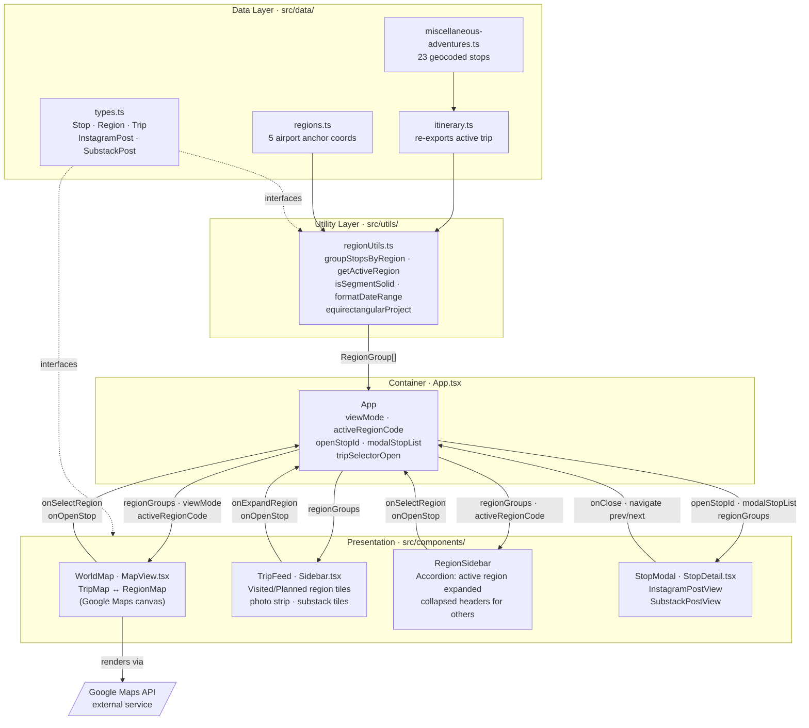

# Component Diagram: World Travelogue

**Feature**: Read-only static travel travelogue — Google Maps canvas + sidebar + stop detail modal
**Generated**: 2026-04-29
**Scope**: Full feature

---

## Overview

This diagram shows the five runtime components of the travelogue SPA, their data dependencies on the utility and data layers, and the bidirectional event flow that drives navigation between the three views.

## Component Diagram

## Component Breakdown

### App.tsx

**Role**: Owns all navigation state and acts as the single source of truth for which view is active.

**Why this exists as a separate component**: The three views (trip overview, region drill-down, stop modal) share state that needs to stay in sync — changing the active region must update both the map center and the sidebar accordion simultaneously. Lifting that state here prevents prop-drilling between siblings and avoids a global state library for a project of this scale.

**Key interactions**:
- → WorldMap: passes `regionGroups`, `viewMode`, `activeRegionCode`, `openStopId`; receives `onSelectRegion`, `onOpenStop`
- → TripFeed: passes `regionGroups`; receives `onExpandRegion`, `onOpenStop`
- → RegionSidebar: passes `regionGroups`, `activeRegionCode`; receives `onSelectRegion`, `onOpenStop`
- → StopModal: passes `openStopId`, `modalStopList`, `regionGroups`; receives `onClose`, prev/next navigation

---

### WorldMap / TripMap / RegionMap (MapView.tsx)

**Role**: Renders the Google Maps canvas in either trip-overview mode (one marker per region, route line) or region-drill-down mode (one marker per stop, dashed route polyline).

**Why this exists as a separate component**: Map rendering has its own lifecycle (Google Maps SDK initialization, marker management, camera controls) that is unrelated to sidebar concerns. Isolating it here means the Google Maps API surface is contained in one file.

**Key interactions**:
- ← App: receives `viewMode` to switch between TripMap and RegionMap; receives `regionGroups` and `activeRegionCode`
- → App: fires `onSelectRegion` when a region marker is clicked; fires `onOpenStop` when a stop marker is clicked

---

### TripFeed (Sidebar.tsx)

**Role**: Renders the trip overview sidebar — Visited and Planned sections, each containing region tiles with photo strips, Substack tiles, and "Expand Region →" buttons.

**Why this exists as a separate component**: The sidebar's concern is presenting aggregate region content (photo grids, post previews, date ranges), not map rendering. Splitting it from the map allows the two panes to evolve independently and be tested in isolation.

**Key interactions**:
- ← App: receives `regionGroups` (already grouped and ordered by `regionUtils`)
- → App: fires `onExpandRegion(code)` when "Expand Region →" is clicked; fires `onOpenStop(id, contextIds)` when a photo thumb or Substack tile is clicked

---

### RegionSidebar

**Role**: Accordion sidebar shown during region drill-down — the active region is expanded showing its stop tiles; all other regions appear as collapsed header rows.

**Why this exists as a separate component**: Region drill-down has different layout and interaction logic than the trip overview (accordion vs. list; stop-level tiles vs. region-level tiles). A separate component keeps each sidebar's logic focused and avoids mode-flag sprawl inside TripFeed.

**Key interactions**:
- ← App: receives `activeRegionCode` to know which accordion section to expand
- → App: fires `onSelectRegion(code)` when a collapsed header is clicked (FR-015: activating a new region collapses the previous)

---

### StopModal (StopDetail.tsx)

**Role**: Modal overlay that dims the background and renders a single stop's full content — Instagram (location heading, caption, hero image) or Substack (title, subtitle, body text).

**Why this exists as a separate component**: Modal overlay and post-type rendering are orthogonal to navigation. The modal needs its own layout (dim area with left/right arrow zones, centered content panel) and its own prev/next traversal logic over `modalStopList`.

**Key interactions**:
- ← App: receives `openStopId` (which stop to show), `modalStopList` (ordered list for prev/next), and `regionGroups` (to build the breadcrumb)
- → App: fires `onClose` (X button or dim click) and navigation events for prev/next stop

---

### regionUtils.ts

**Role**: Pure utility functions that derive `RegionGroup[]` from the flat stop array, compute the active region (FR-011), determine segment line style (FR-012), and calculate region end dates (FR-014).

**Why this exists as a separate component**: All business logic for region derivation lives here, keeping components dumb presenters. Because it's pure functions with no side effects, it's also the easiest layer to reason about and verify.

**Key interactions**:
- ← Data layer: consumes `Stop[]` from `miscellaneous-adventures.ts` and `Region[]` from `regions.ts`
- → App: returns `RegionGroup[]` which flows to all presentation components as props

---

## Design Reasoning

### Why this structure?

The component decomposition follows the data flow naturally: a flat stop array is enriched into `RegionGroup[]` by `regionUtils`, flows into `App` state, and fans out to the three presentation components via props. This keeps components purely presentational and the utility layer purely functional — the only stateful layer is `App.tsx`. The Google Maps isolation in `MapView.tsx` matches the constitution's requirement to use Google Maps without coupling that dependency to sidebar or modal logic.

### Alternatives considered

| Structure | Why it wasn't chosen |
|-----------|---------------------|
| Single `App.tsx` with all UI inlined | Would create a ~600-line file where map, sidebar, and modal logic compete for space; impossible to evolve independently |
| Global state store (Redux / Zustand) | Adds a dependency for state that is straightforwardly owned by a single parent component; overkill for three view modes |
| Separate MapPage / RegionPage routes | React Router adds complexity for what is essentially a single-page layout change; view switching via state is simpler and avoids URL management |

### When you'd restructure

If the travelogue adds real-time updates (e.g., live location tracking), `App.tsx`'s synchronous state model would need to move toward a subscription-based model, and `WorldMap` would need its own data subscription rather than receiving stale props. If post types expand beyond Instagram and Substack, `StopModal` would benefit from a plugin-style post renderer registry rather than the current if/else switch.
