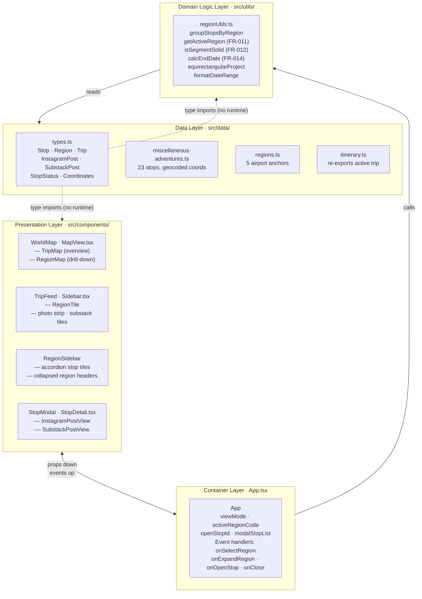

# Software Architecture: World Travelogue

**Feature**: Read-only static travel travelogue SPA
**Generated**: 2026-04-29
**Scope**: Full project

---

## Overview

The travelogue uses a **layered architecture** with four layers: a static data layer, a pure-function domain logic layer, a stateful container layer, and a presentational component layer. Dependencies flow strictly downward — presentation depends on the container, the container depends on domain logic, and domain logic depends on data. No layer reaches upward.

## Architecture Diagram

## Architectural Pattern: Layered + Unidirectional Data Flow

**What it is**: A layered architecture organizes code into horizontal tiers where each tier has a single responsibility and only depends on the tier below it. Unidirectional data flow means state lives at the top (App) and changes only in response to explicit events from below — not through shared mutable references.

**Why this pattern**: The travelogue has three interactive views that must stay in sync (map, sidebar, modal) but have no backend. A layered structure prevents the map component from directly mutating sidebar state, which would create invisible coupling. Unidirectional flow (React props down, events up) means every state change has one source of truth and is easy to trace when debugging view transitions.

**Tradeoffs accepted**:
- ✓ Any component can be understood in isolation — it only reads props and fires events
- ✓ Domain logic is testable without mounting any component
- ✗ Adding a new deeply-nested interactive element requires threading event handlers through several layers (mitigated: the component tree is only 2-3 levels deep at this scale)

## Layer Breakdown

### Data Layer — `src/data/`

**Responsibility**: Provide the raw, immutable itinerary content that the application renders.

**Depends on**: Nothing (innermost layer).

**Depended on by**: Domain Logic layer (`regionUtils.ts`), and type-only imports in Presentation.

**Why this boundary exists**: All itinerary content is hard-coded at build time. Isolating it in `src/data/` means replacing the data source (e.g., loading from a CMS API in a future version) requires changing only this layer without touching domain logic or components.

---

### Domain Logic Layer — `src/utils/regionUtils.ts`

**Responsibility**: Derive `RegionGroup[]` from raw stops and implement the business rules in FR-011, FR-012, and FR-014.

**Depends on**: Data layer (reads `Stop[]`, `Region[]`, `Trip`).

**Depended on by**: Container layer (`App.tsx`).

**Why this boundary exists**: Region derivation is the core business logic of the travelogue — which stops belong to which region, what the active region is, and whether route segments are solid or dashed. Placing it here instead of inside a component means the rules are testable in isolation and don't get tangled with React lifecycle concerns.

---

### Container Layer — `App.tsx`

**Responsibility**: Own all navigation state, compose the layout, and wire event handlers between presentation components.

**Depends on**: Domain Logic (calls `groupStopsByRegion`, `getActiveRegion`) and Presentation (renders components).

**Depended on by**: Nothing (outermost runtime layer).

**Why this boundary exists**: Keeping state in one container prevents the map and sidebar from independently tracking which region is active — a sure path to split-brain UI bugs. App is the single arbiter of which view is rendered and what is highlighted.

---

### Presentation Layer — `src/components/`

**Responsibility**: Render UI from props; emit events for user interactions. No business logic; no local state beyond ephemeral UI concerns (e.g., image load errors).

**Depends on**: Types from Data layer (type-only); props from Container.

**Depended on by**: Container layer receives their events.

**Why this boundary exists**: Pure presentational components can be replaced or restyled without touching domain logic. For example, swapping the sidebar from `TripFeed` to a timeline view requires only a new Presentation component — the data pipeline and state management are unchanged.

---

## Module Organization

**Strategy**: By role/layer, not by feature.

Files in `src/data/` are the data source; files in `src/utils/` are pure functions; files in `src/components/` are UI. This mirrors the four-layer diagram directly — a developer looking for "where does the active region get computed?" can find it in `src/utils/regionUtils.ts` without scanning component files.

See `plan.md` for the full file tree with path-level details.

## When This Architecture Evolves

If the travelogue adds live content (e.g., a posting workflow where travelers push updates from the field), the static Data layer would need to become a data-fetching layer with async loading state, and the Container layer would need to handle loading/error states. The Domain Logic and Presentation layers would not need to change — that's the value of the separation. If multiple trips need to load simultaneously with cross-trip navigation, `App.tsx` would need to lift its single-trip assumption and the Domain Logic layer would need multi-trip grouping support.
