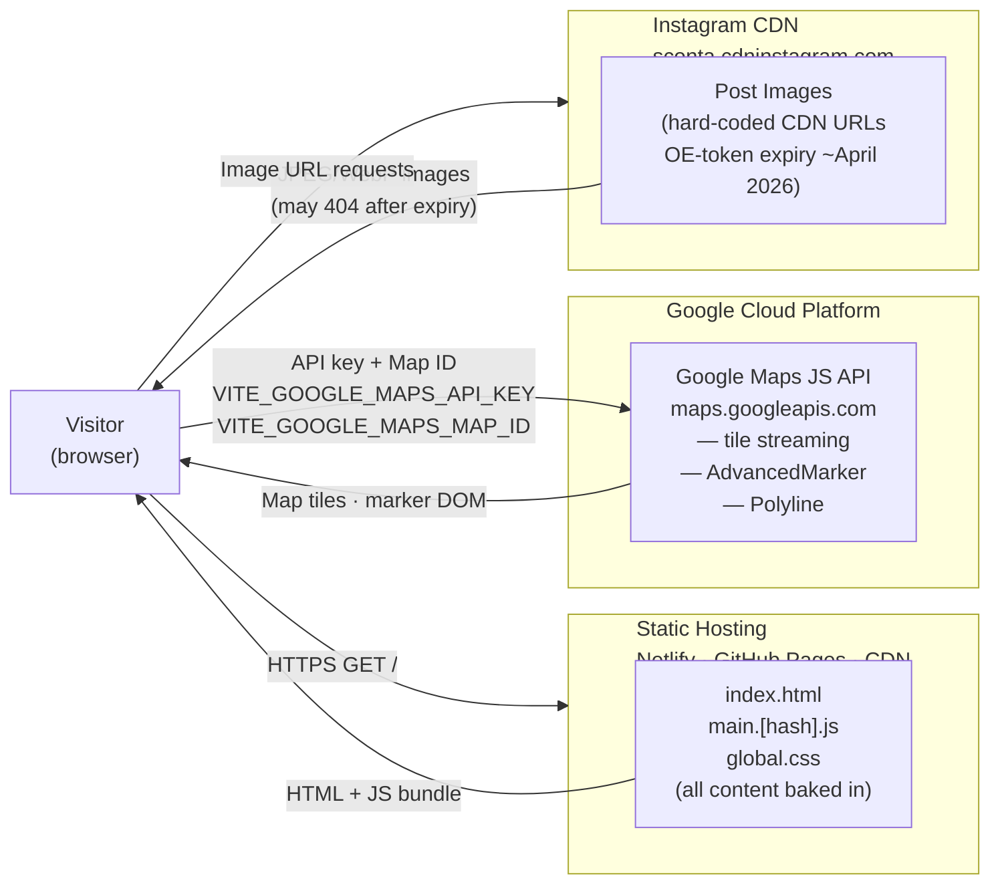
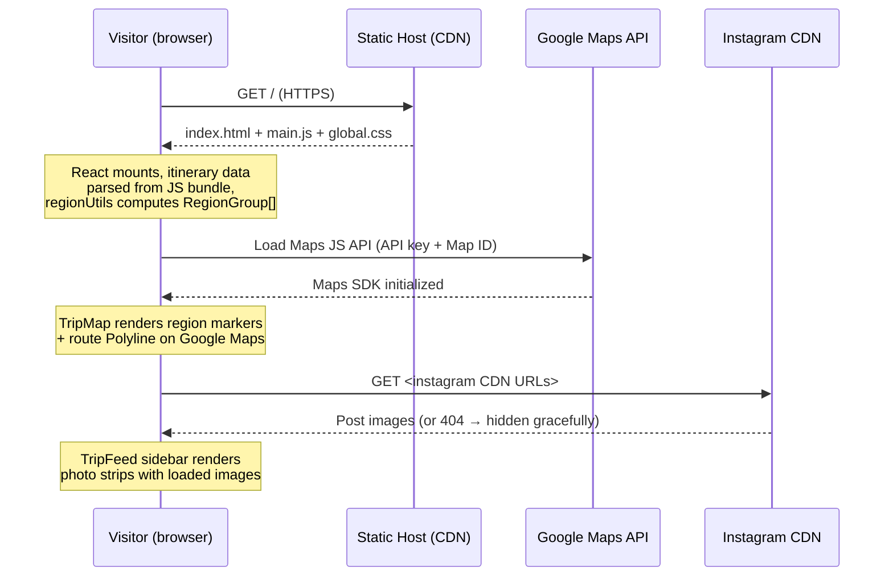

# System Design: World Travelogue

**Feature**: Read-only static travel travelogue SPA
**Generated**: 2026-04-29
**Scope**: Full project

---

## Overview

The travelogue is a static single-page application delivered from a CDN. Visitors load one HTML file and a small JS bundle; all itinerary content is baked into that bundle at build time. The only runtime external dependency is the Google Maps JS API, which streams map tiles and handles marker rendering. Instagram CDN provides post images via hard-coded URLs embedded in the bundle.

## System Design Diagram

## Infrastructure Decisions

### Static Hosting (Netlify / GitHub Pages)

**What**: The entire site is a Vite-built static bundle — one HTML file, one JS chunk, one CSS file.

**Why**: The spec requires no server-side processing and all content hard-coded. A static host (Netlify, GitHub Pages) satisfies the constitution's "Static First" principle, costs nothing at this traffic scale, and makes the deployment a single `npm run build` + `git push`.

**Alternatives considered**:
| Option | Why it wasn't chosen |
|--------|---------------------|
| Node.js / Express server | No dynamic data exists to justify a server; adds infrastructure cost and operational burden |
| Next.js SSG | Adds framework overhead (file-based routing, build pipeline complexity) for a single-page app with no SEO requirements |

**When you'd choose differently**: If the itinerary needs to update without a code deploy (e.g., a CMS or live posting workflow), a lightweight serverless function and a CDN cache invalidation strategy would replace the static build approach.

---

### Google Maps JS API

**What**: Google Maps is loaded asynchronously via `@googlemaps/js-api-loader` using `VITE_GOOGLE_MAPS_API_KEY` and `VITE_GOOGLE_MAPS_MAP_ID` from `.env`.

**Why**: The constitution mandates Google Maps for map visualization. `AdvancedMarker` provides clickable region and stop markers; `Polyline` renders the solid/dashed route segments between regions. The Map ID enables Advanced Markers (required for custom DOM marker elements such as the teardrop active-region pin).

**Alternatives considered**:
| Option | Why it wasn't chosen |
|--------|---------------------|
| Leaflet + OpenStreetMap | Open-source and free, but the constitution specifies Google Maps and future Google Location Search geocoding |
| SVG equirectangular projection | Used as an interim placeholder; replaced once the API key was provisioned |
| Mapbox GL JS | Excellent tile quality but not Google Maps; deviates from constitution and future geocoding plan |

**When you'd choose differently**: If the project scales to thousands of markers with clustering requirements, Mapbox GL JS's WebGL renderer would outperform Google Maps' DOM-based AdvancedMarker approach.

---

### Instagram CDN (image source)

**What**: Post images are hard-coded Instagram CDN URLs embedded in `miscellaneous-adventures.ts`. No proxy or re-hosting.

**Why**: Images are sourced from exported Instagram post data. Re-hosting 23 images in `public/` is feasible but adds manual work; using the CDN URLs is the simplest path for an initial static build.

**Known risk**: Instagram CDN URLs contain `oe=` timestamp tokens that expire (observed expiry ~April 2026). After expiry, image requests return 404. The app handles this with `onError` handlers that hide the broken image element gracefully (FR-009 compliance).

**When you'd choose differently**: For a production site with stable images, download and commit the images to `public/` or an object storage bucket (S3 / Cloudflare R2) to eliminate the CDN expiry risk.

---

## Data Flow

The primary visitor request path:

## Scaling & Reliability Notes

**Scale**: The current dataset is 23 stops / 5 regions. The static bundle approach scales to thousands of stops without any infrastructure change — it's all in-memory JS once loaded.

**Google Maps API quota**: At zero server-side rendering, each visitor loads the Maps JS API once per session. At the expected traffic level (friends and family), Maps API costs are negligible (well within the free tier).

**Failure modes**:
- Google Maps API unavailable → map canvas blank; sidebar and modal still function with hard-coded data
- Instagram CDN expiry → images hidden via `onError`; captions and metadata still display
- No graceful degradation for JavaScript-disabled browsers (accepted: SPA requirement)
